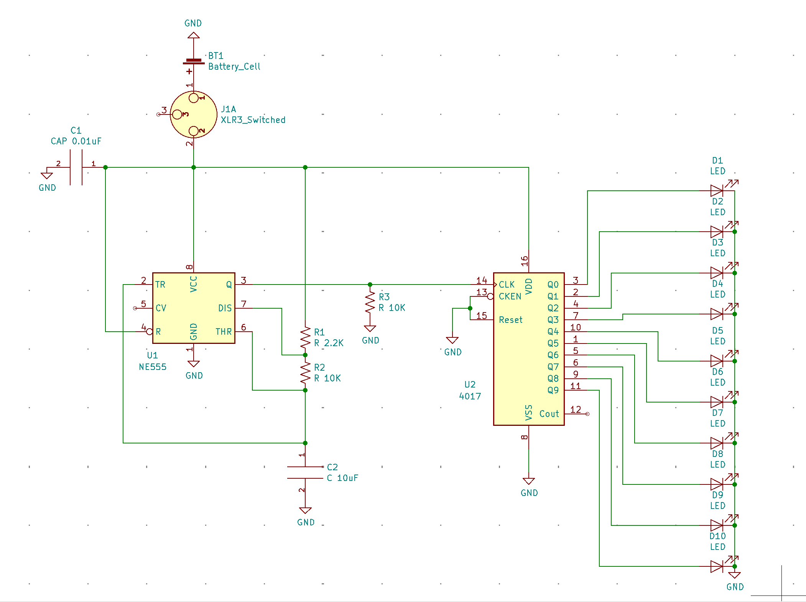
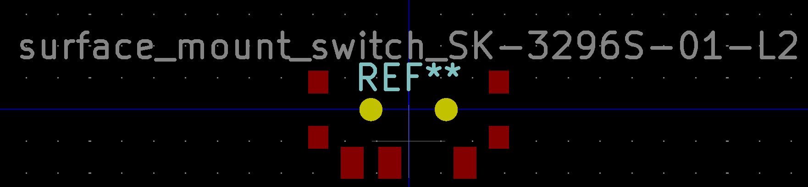
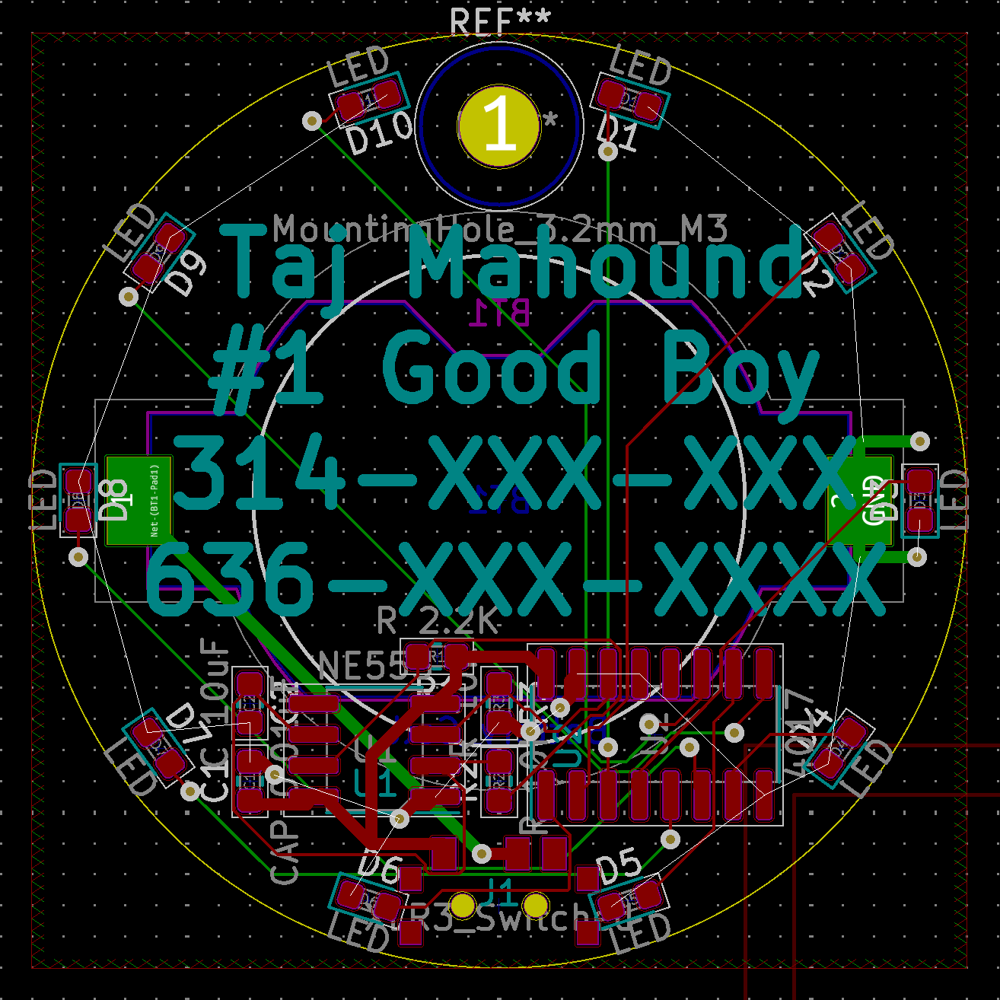
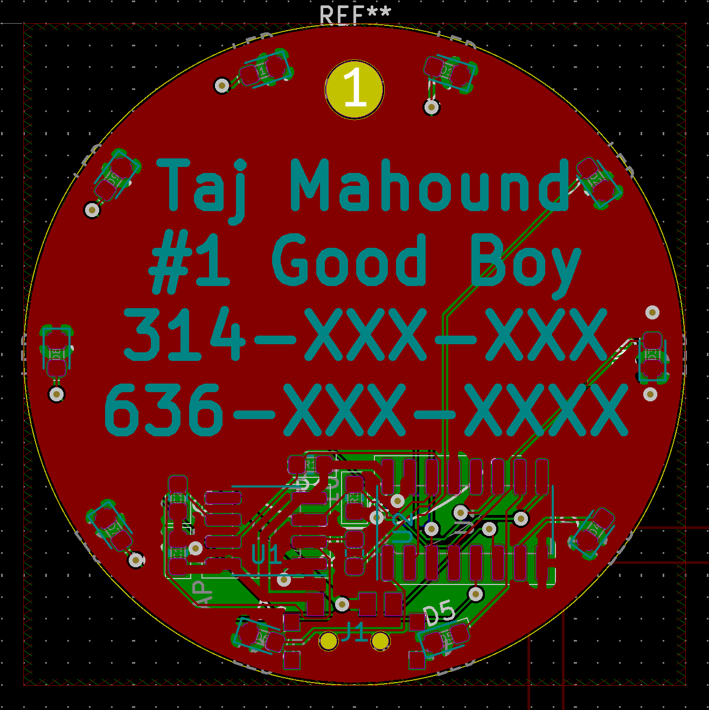
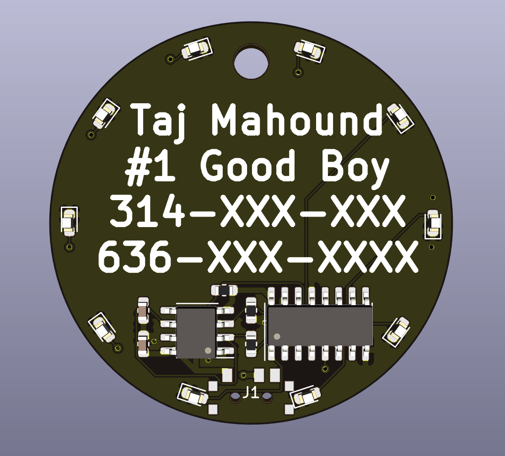
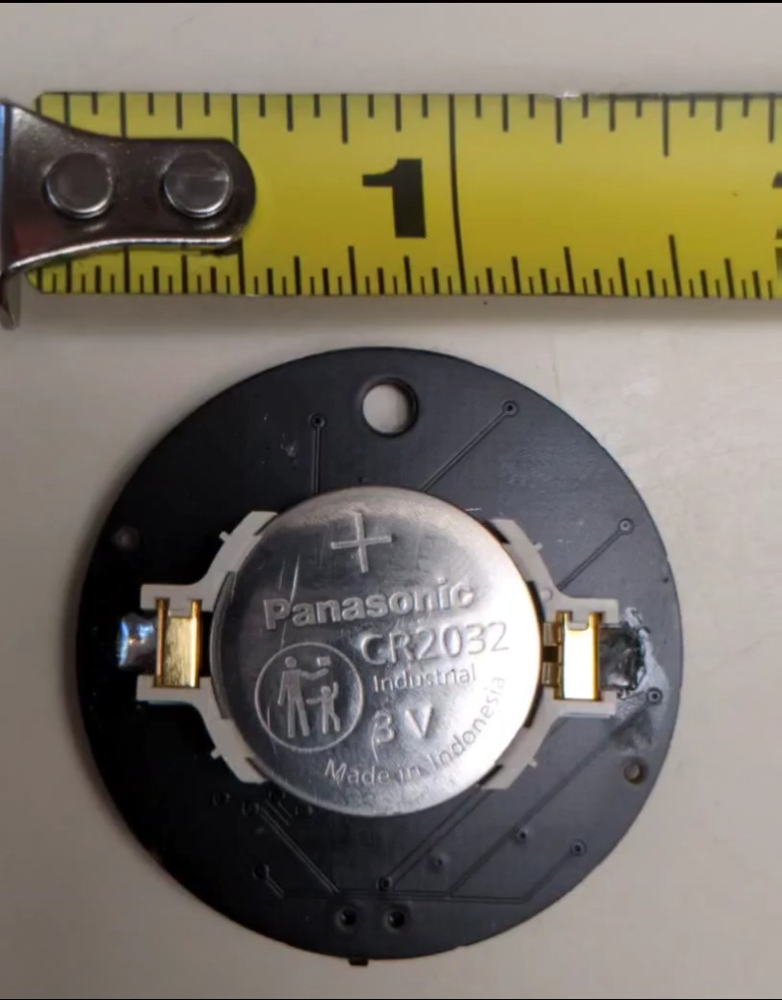

# PCB file to make an LED chaser doggo tag for any number 1 good doggo.
## Below is what the final product ended up looking like.

One day my number 1 good boy through no fault of his own lost all of his doggo tags. So naturally, instead of simply buying him a new dog tag at minimal cost and effort, I decided to make a special dog tag for my special boy so that everyone would know just how special he is. I mean just look at how cute he is...

or in the sand.

Anyway, resisting the urge to post a thousand good boy pictures... I decided I wanted some blinking LEDs and after a bit of googling ended up deciding on an LED chaser circuit e.g. [Nuts and Volts](https://www.nutsvolts.com/magazine/article/led-chaser-sequencer-circuits) or [Electro Schematics](https://www.electroschematics.com/led-chaser/).

Then I set out to design this circuit in [KiCad](https://kicad.org/) (my favorite PCB design software). 
Before designing even the schematic though I decided on what ICs I was going to use. Basically, I knew that I wanted to try JLCPCB's SMT assembly service. Mostly because an SMD versus a through-hole PCB would just look slicker in my opinion. Also, it was a good opportunity to learn how to specify and SMD board. JLCPCB also is very affordable which made such a project possible with a modest budget (still not the cheapest dog tag in the end). So I picked out a 555 timer and a CMOS decade counter that are in JLCPCB SMT [library](https://jlcpcb.com/parts) and in stock. In particular the [NE555](http://www.ti.com/lit/ds/symlink/ne555.pdf) and the [CD4017BM96](https://datasheet.lcsc.com/szlcsc/1809042113_Texas-Instruments-CD4017BM96_C11349.pdf). The CD4017BM96 stated it would work down to 3V which was what I needed to run the LED chaser off a battery. Likewise, I made sure the LED run off a voltage of less than 3V [NCD0603W3](https://datasheet.lcsc.com/szlcsc/2008201033_Foshan-NationStar-Optoelectronics-NCD0603W3_C158100.pdf).

I wired up the 555 timer in the schematic for astable operation as shown on page 11 of the datasheet. You set the rate of the LED chaser by setting the values of  RA, RB, and C. I used an online [calculator](https://www.xarg.org/tools/ne555-astable-circuit-calculator/) to choose the component values to obtain a rate of ~6 Hz. Then I wired the output of the 555 timer into the clock input of the CD4017B. Then I just added an LED to each of the output pins of the CD4017B. Since the battery will just supply 3V there was no need for any current limiting resistors in series with the LEDs. Then I just added in a [switch](https://lcsc.com/product-detail/New-Arrivals_XKB-Enterprise-SK-3296S-01-L2_C500051.html) and a battery into the circuit. For the battery, I chose an SMD part that was already in the KiCad footprint library. JLCPCB didn't stock it but the battery needed to go on the back anyway and JLCPCB only does SMD assembly on one side. Below is my schematic. 

There are good tutorials already out there on how to use KiCad ([check out SparkFun's](https://learn.sparkfun.com/tutorials/beginners-guide-to-kicad)) so I won't go into too much detail on that part of the project. However, when assigning footprints KiCad had all of the footprints I needed for my SMD components except for the [switch](https://lcsc.com/product-detail/New-Arrivals_XKB-Enterprise-SK-3296S-01-L2_C500051.html). So I had to draw up a new footprint for that part from the diagram in the datasheet. You can find it in this same repository [here](https://github.com/Wheeler1711/kicad/tree/main/my_footprints/switch.pretty). Picture below.

My good boy needed a new tag soon so that he didn't wander off and get lost, so I didn't spend too much time making the prettiest PCB or fanciest design. Your version two could be in the shape of a dog bone! I did a bit of quick math to place the LEDs evenly around the circle (see the excel file in the repository) and wired everything up. Below is a picture of the PCB after I had everything wired up. 

I didn't wire up any of the grounds I just let the ground pour accomplish that for me. After the ground pour.

Finally, the 3D rendering from KiCad is shown below without the switch which I didn't bother making a 3D model for.  

I used the instructions [here](https://support.jlcpcb.com/article/84-how-to-generate-the-bom-and-centroid-file-from-kicad) to create the BOM and position file needed for the JLCPCB software to do the SMD assembly. After uploading the files to JLCPCB's website their preview showed that the IC's rotation angles were off by 90 degrees so I just manually edited the top-pos.csv file by subtracting 90 degrees and re-uploaded. The version in this repository is the corrected version. 

If you want to make one for your self just download the project. Open the PCB design in PCBnew and changed the text on the front silkscreen to have your doggo's name and numbers. Then go to File->Plot. Make sure the plot format is set to Gerber. Then hit Plot. Also, click Generate Drill Files... under the same plot pop-up and then click Generate Drill File. Then you just need to zip all of the .gbr and .drl files and upload that file through JLCPCB's website. Then when prompted upload the BOM and top-pos.csv file. If you haven't changed the circuit the current versions should work just fine. The JLCPCB website gives you previews of the board and the SMD components so you should notice if something is amiss.

I chose a black PCB because it was prettier than green and a blue PCB required me to get qty 30 instead of a min quantity of 5 which would have brought the price up ~$20. In the end with a 7 dollar off coupon for SMT assembly the board cost me $18.46 with an additional $17.80 for the shipping. Part of the cost is from some of the parts being from the extended part library which triggers a 9 dollar fee, however, since all of the CD4017Bs are in the extended library you will need to come up with a different circuit to avoid this. In the end, I would have been better off in terms of budget to just have purchased a regular dog tag but would have had much less fun. 

Finally, I also need the SMD [part](https://www.digikey.com/en/products/detail/keystone-electronics/1058/5255484) for the battery which I bought from Digikey along with some [batteries](https://www.digikey.com/en/products/detail/panasonic-bsg/CR2032/31939) as well. 5 holders and 5 batteries came out at 6.70 but then I paid another $15 in shipping. If you are clever you might avoid the shipping charges by finding a local supplier of the battery holder component and of course you can buy the batteries from lots of different stores. 

A couple weeks later my PCBs arrived and I just had to quickly solder on the battery holder which given the large contacts was no trouble at all.

To my surprise, the board worked right out of the box (not the usual situation for many of my projects). Since the board doesn't have any microcontrollers there is no need to program anything and it just works right away. Of course, if you made a tag with a microcontroller you would be able to program in new LED patterns. The final product is shown at the very top of the page. And below is a picture of my #1 good boy showing off his new bling. Warning this is not recommended for good doggo's who might be tempted to eat batteries. I leave the battery out when it is not in use.

